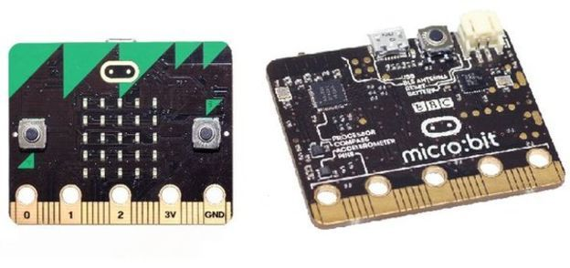
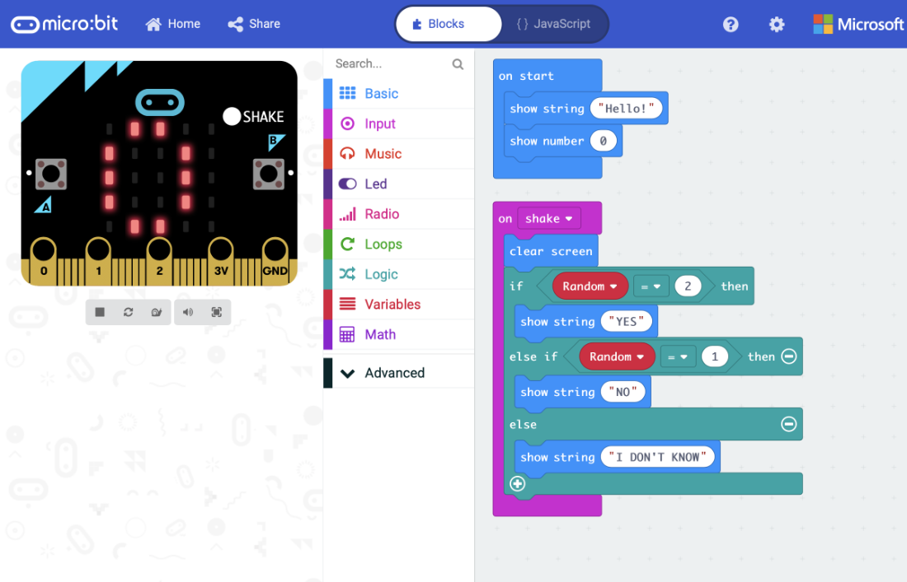
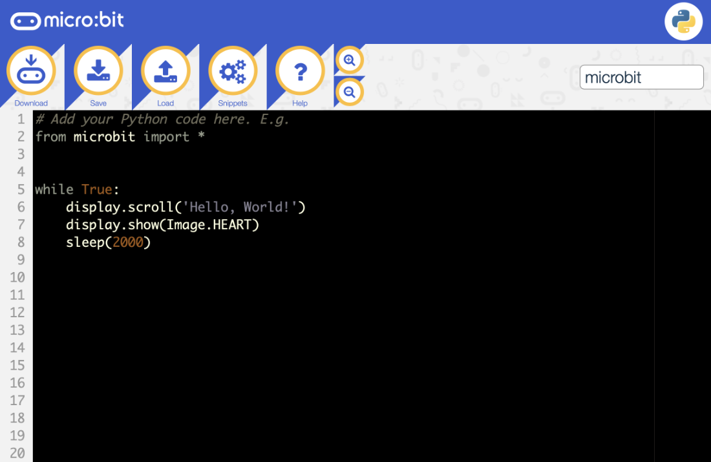
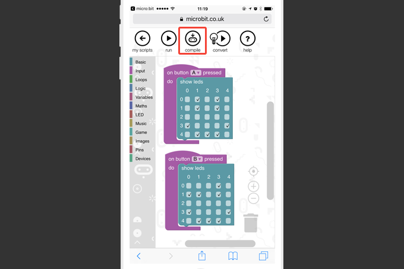
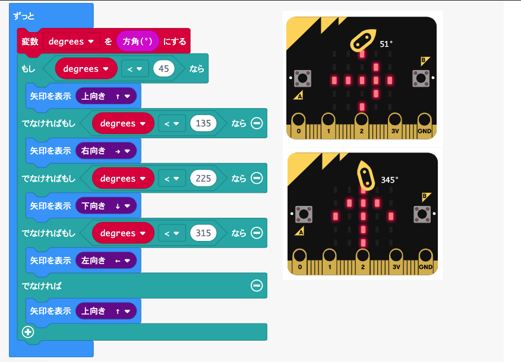
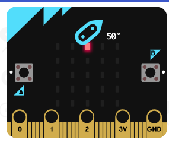
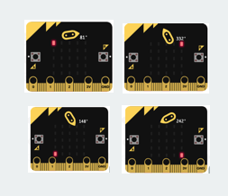
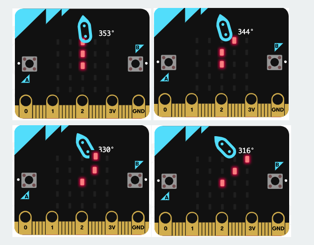
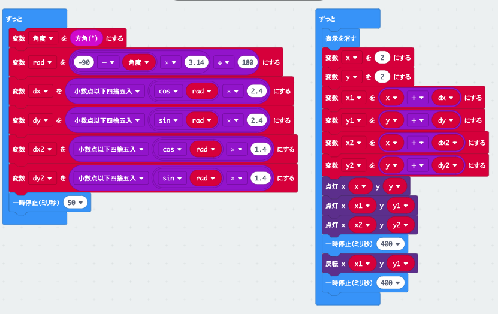

<!-- 
  $theme: gaia
  template: invert
-->
<!-- footer: Let's play micro:bit -->
<!-- page_number: true -->

# Let's play micro:bit

2019-06-19 katoy

***
## Who am I

- 加藤洋一 　　　

- [https://qiita.com/katoy/items/9bcba54b88c5fc7d9aa6](https://qiita.com/katoy/items/9bcba54b88c5fc7d9aa6)
gem をクリーンにする。(いいね 121)
- [https://github.com/katoy/amazon-orders](https://github.com/katoy/amazon-orders)
webdriver を使って amazon.co.jp での購入履歴情報を取得する
- [https://github.com/katoy/scala_rational](https://github.com/katoy/scala_rational)
分数 / 循環小数を扱える scala ライブラリー

***

# 今日の目的

micro:bit について
- 公式情報, 書籍の紹介
- 公式サンプルの１つ(磁気コンパス)を深掘りしてみた例を紹介

***
## micro:bit とは (1/2)
- 英国の公共放送局であるBBCが中心となって開発
- 英国では2015年、11歳から12歳 (7年生) の子ども全員に無償配布！

- 個々にプログラムできる25個のLED
- 2個のボタン、リセットボタン
- 25個の外部接続
- センサー(明るさ, 温度, 加速度計, 地磁気)
- Bluetooth
- USBインターフェース (3Vのパワーで可動)

***

***
## micro:bit とは (2/2)
- MakeCodeエディタ (ブロックまたはJavaScript)
- Pyton エディタ
- web 上のIDE, アプリのIDE(iOS, iPad)

***
MakeCode (PC, Web0

***
Python エディタ

***
iOS

***
## 公式情報, 書籍の紹介

- 本家サイト (日本語版もある)
[https://microbit.org/ja/guide/](https://microbit.org/ja/guide/)

- amazon.com の kindle 無料本だけでも 5 冊ある。(どれも平易な英語)

***
## 公式サンプルの１つを深掘り！

***
サンプルコード

***
# 4方向しか示せてない！

# もっと分解能を高めて
# みよう！

***
# LED 1 つでコンパス

- 北向きに近くなるほどLEDの点灯間隔を点滅
- ほぼ北を向いたら、通常の点灯にする
***
# LED 2x2 のコンパス

***
# LED 3x3 のコンパス

- 省略

***
# LED 4x4 のコンパス
- 省略

***
# LED 5x5 のコンパス

***
コード

***
# 分解能 24を実現！

***
# わずかな工夫で
# 教材コードを拡張できる

***
# Thanks!

# 前回:　Let's Rspec
# 次回:　Let's HaloCode
# あるいは
# Let's docker

***
このスライドは marp を使って作成しました。

原稿: https://github.com/katoy/sample-microbit/blob/work/compass/slide/README.md

